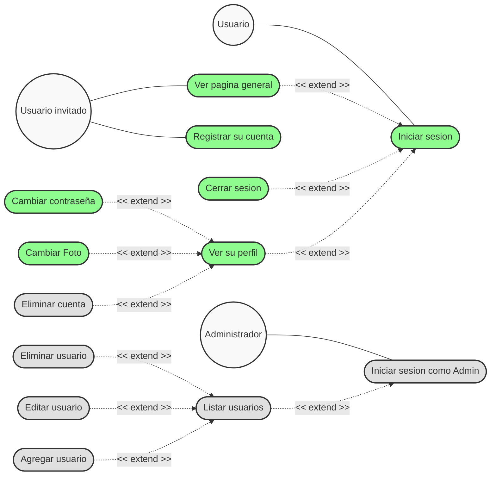

# Diagrama de Casos de Uso - MediApp (Actualizado)

A continuación, presento el diagrama de casos de uso estructurado utilizando Mermaid para reflejar exactamente todas las funciones que hemos implementado en la aplicación, de forma idéntica al diagrama original que facilitaste.

### Nota de Diseño
* **Verdes:** Representan los casos de uso principales e interacciones cotidianas.
* **Gris:** Representan funciones destructivas o limitadas que antes "faltaban", correspondientes directamente a los recuadros grises de tu imagen (zonas de peligro en usuario y todo el módulo de panel de Control del Administrador). 

> [!NOTE]
> Todo lo que aprecias en este mapa está actualmente funcional en el código a través de la carpeta `backend/` y `frontend/`.
